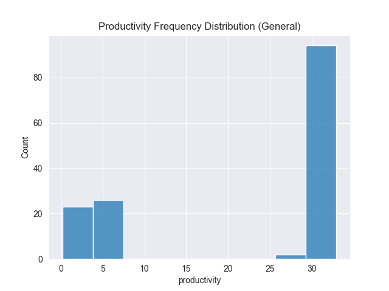
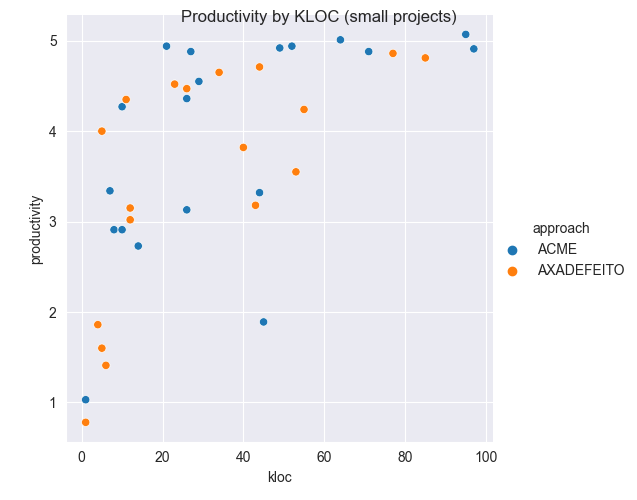
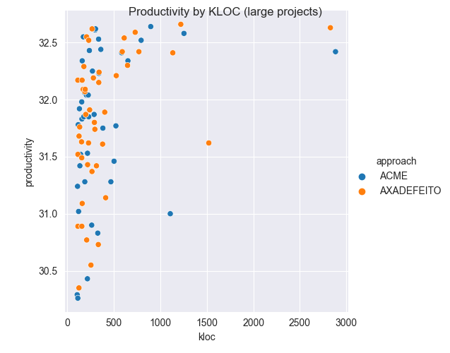
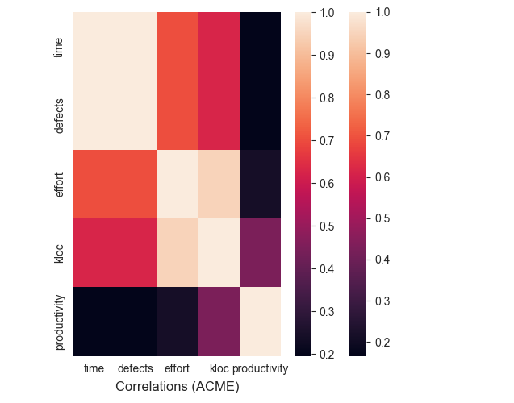
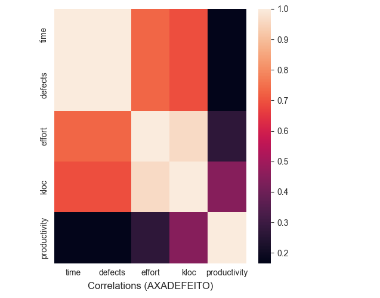
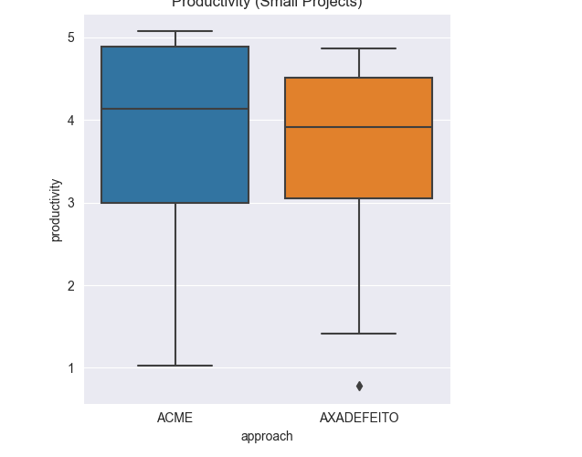
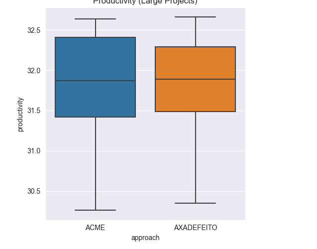

# ACME experiment analysis

This document presents some analysis (using the `ACME_dataset.csv` data) to compare ACME and AXADEFEITO defect detection methods.

## Descriptive

The following tables show the basic statistical descriptors of the datasets. First the ACME results:

|       |     time |   defects |   effort |     kloc |   productivity |
|:------|---------:|----------:|---------:|---------:|---------------:|
| count |  73      |   73      |  73      |   73     |        73      |
| mean  |  43.4589 |   17.3836 |  45.5633 |  291.822 |        21.8322 |
| std   |  49.2824 |   19.713  |  53.8843 |  454.935 |        13.4829 |
| min   |   0      |    0      |   2.25   |    1     |         1.03   |
| 25%   |  17.5    |    7      |  17.44   |   44     |         4.91   |
| 50%   |  25      |   10      |  28.34   |  159     |        31.24   |
| 75%   |  55      |   22      |  51.13   |  305     |        32.06   |
| max   | 250      |  100      | 355.76   | 2883     |        32.9    |

|              |     median |
|:-------------|-------:|
| time         |  25    |
| defects      |  10    |
| effort       |  28.34 |
| kloc         | 159    |
| productivity |  31.24 |

Then AXADEFEITO's results:

|       |     time |   defects |   effort |     kloc |   productivity |
|:------|---------:|----------:|---------:|---------:|---------------:|
| count |  72      |   72      |  72      |   72     |        72      |
| mean  |  43.6458 |   17.4583 |  44.9297 |  300.833 |        22.6468 |
| std   |  37.3693 |   14.9477 |  52.0225 |  444.036 |        13.4482 |
| min   |   0      |    0      |   2.25   |    1     |         0.18   |
| 25%   |  20      |    8      |  17.9375 |   43.75  |         4.695  |
| 50%   |  36.25   |   14.5    |  28.27   |  167     |        31.46   |
| 75%   |  55      |   22      |  50.98   |  320     |        32.17   |
| max   | 247.5    |   99      | 346.66   | 2828     |        32.96   |

|              |      median |
|:-------------|-------:|
| time         |  36.25 |
| defects      |  14.5  |
| effort       |  28.27 |
| kloc         | 167    |
| productivity |  31.46 |

The productivity can be analyzed using a histogram:

Productivity by KLOC (small and large projects)

Correlations:

Boxplots:

## Outlier Analysis

Given the data does not follow a normal distribution, we proceeded with a percentile-based approach to identify outliers. Five cases were found using the 5%-95% percentiles. Those were most common on AXADEFEITO over the lower bound, what could mean some issue with the training towards the new method.
